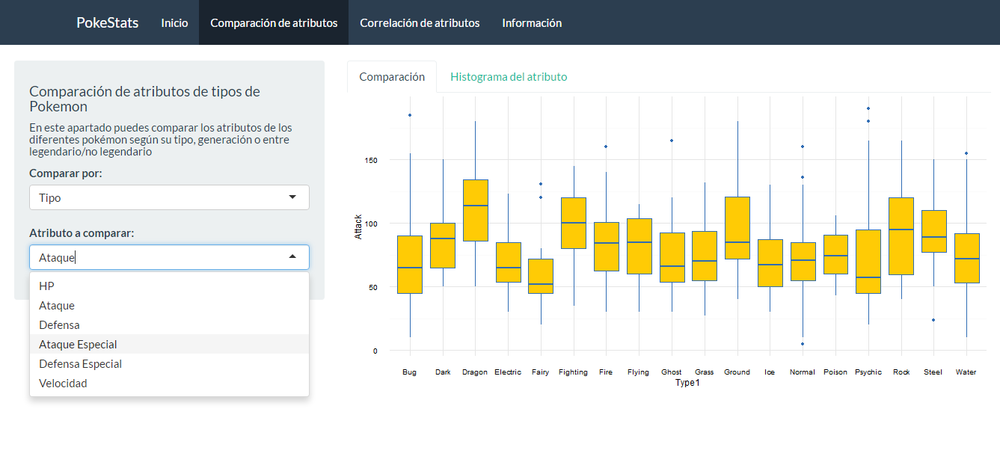

# pokestats
A simple shiny app to explore some data from the popular videogame *Pokemon*. 

:star: New update soon! :star:



To run the app, use the following lines of code in **R**:

```{r}
install.package("shiny") # Use this line to download the package
library(shiny)
runGitHub("pokestats", "DavidTorresP5")
```

You can download the data following this [link](https://www.kaggle.com/abcsds/pokemon).
