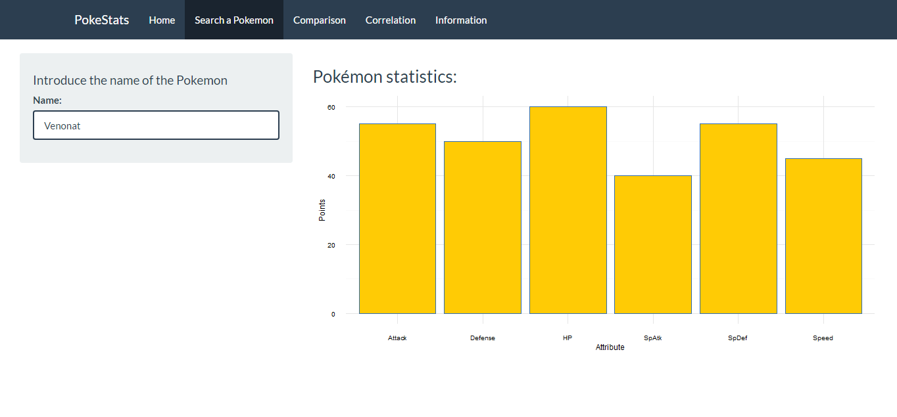
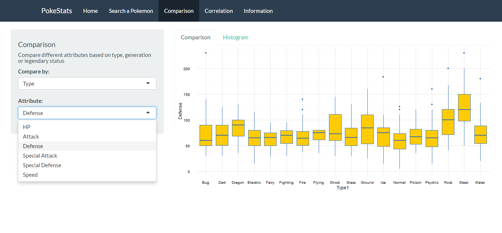
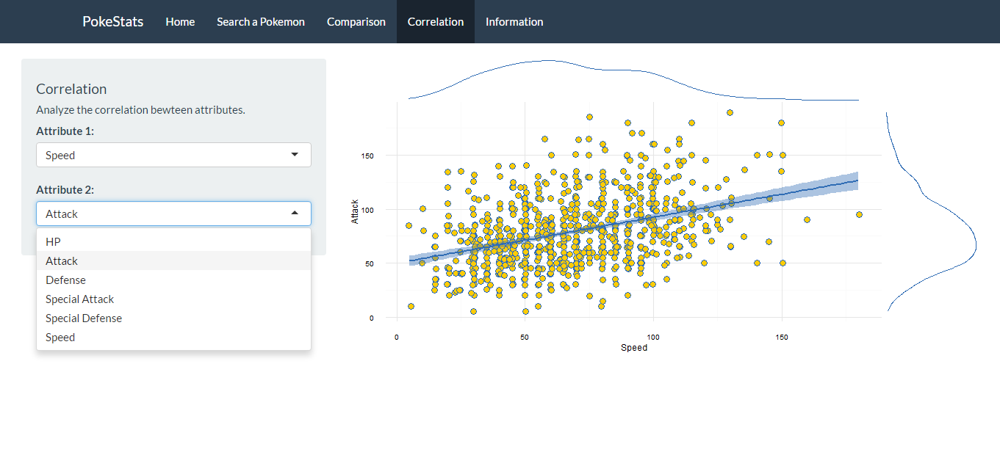

A shiny app to explore some data from the popular videogame *Pokemon*. 

:star: New update soon! :star:

Search your favourite pokemon and see its stats...



Compare types, generations...



Explore correlations!



To prepare the enviroment for the app, run the following lines of code in **R**:

```{r}
# Use these lines to download the required packages
install.packages("shiny")
install.packages("ggplot2")
install.packages("shiny")
install.packages("shinythemes")
install.packages("dplyr")
install.packages("tidyr")
```
Or use this [script](requirements.R) to install the packages faster.

and after that... Run the app!

```{r}
# Run the app:
library(shiny)
runGitHub("pokestats", "DavidTorresP5")
```

You can download the data following this [link](https://www.kaggle.com/abcsds/pokemon).
